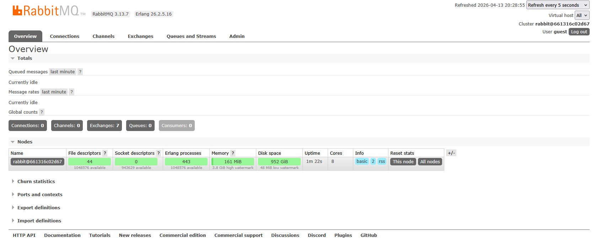
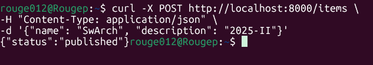
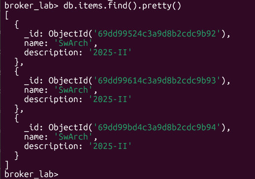
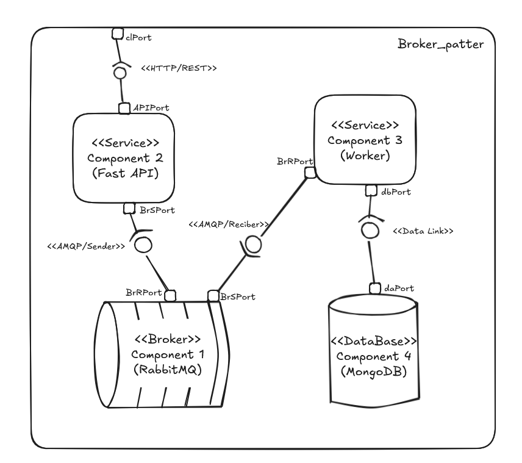

# Laboratory #3
Juan Felipe Hernández Ochoa

## Lab development
In this Readme you can find the resolution of laboratory number 3 (PDF with requeriments is in this repository level).

This implementation shows a microservices system with broker implementation.

The componets of the system are:
 

| Components    | Description |
| ------------- |:-------------:|
| Componet 1 - Broker | Is primarily responsible for the asynchronous part of the system. Recive the message for component 2 when the user send a RESTFUL request, maintaining information persistence saving the information in a durable queue. Forwards, send the message to consumers componet 3 through the queue|
| Component 2 - Fast API| Expose a HTTP API with FastAPi. When the user send a POST request with name and description, the componet send that information into JSON file to the broker. Besides the standar HTTP codes, if the code is 200, they send a confirmation message.|
| Componet 3 - Worker | Every time that a message arrives to a queue, the worker extract the JSON file and save it sended to a MongoDB database. The worker listen the queue all the time while the system is up|
| Componet 4 - Database | Is a Mongo database that store the name and description from the JSON file that componet 3 send |

---

The following images show the Flow test for two request of each database.

__Broker Dashboard__

__Producer API__

__Database Verification__

---

## Components and connectors view

---

## Description of the identified asycronous communcation

